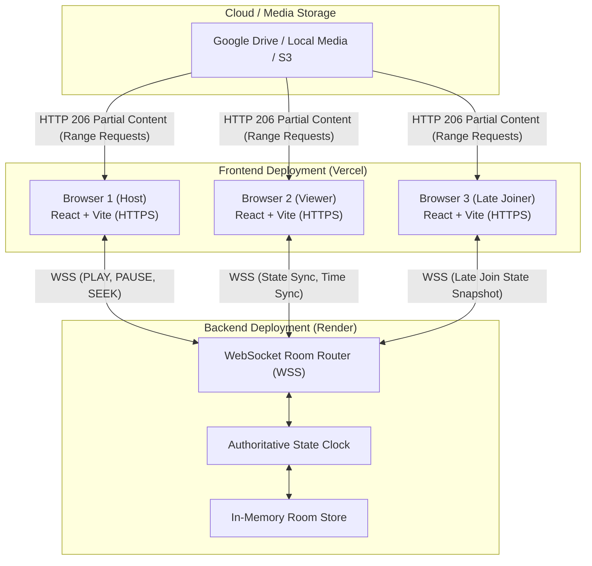

# WatchTogether: Synchronized Watch-Room Web Application

A full-stack, low-latency web application that allows multiple participants to enter a private watch room and watch movies synchronously.

The system is built on a fundamental architectural principle: **The high-bandwidth video data path and the low-latency playback synchronization path are strictly separated.**

---

## Architecture Overview



### 1. Why Video Delivery and Synchronization Are Separated
In naive watch-party implementations, the server proxies or streams video bytes to every connected user:
```
Storage ──> Backend Server ──> User 1, User 2, User 3...
```
This quickly causes severe server network bottlenecks, high CPU/memory pressure, bandwidth costs, and buffering delays.

In **WatchTogether**:
* **Video Path**: Each browser requests media directly using standard **HTTP Range Requests** (`Range: bytes=X-Y` $\rightarrow$ `206 Partial Content`). Browsers buffer and seek progressively without routing heavy video bytes through the control server.
* **Control Path**: The backend communicates tiny JSON messages over full-duplex WebSockets (`PLAY`, `PAUSE`, `SEEK`, `TIME_SYNC`), with payloads typically $< 150$ bytes and transmission latency $< 30\text{ms}$.

### 2. Why WebSockets Are Used
WebSockets maintain a persistent, bidirectional, full-duplex TCP channel between client and server. Playback commands trigger instant event broadcasts without the polling delays, header overhead, or connection handshakes inherent to HTTP polling.

### 3. Why WebRTC Is Not Used
WebRTC is designed for real-time peer-to-peer audio/video streaming (e.g. video conferencing). For synchronized watching of pre-encoded video files:
* WebRTC requires complex signaling, STUN/TURN servers, NAT traversal, and peer upload bandwidth.
* One user's upload connection would have to feed multiple viewers.
* In contrast, HTTP byte-range delivery from cloud storage paired with WebSocket state coordination is lighter, more scalable, and browser-native.

---

## Synchronization Mechanics

### 1. Authoritative Server State
The server acts as the single source of truth for the room:
```json
{
  "roomId": "AB7X9K",
  "isPlaying": true,
  "position": 124.50,
  "lastStateChangeServerTime": 1789234567890
}
```

When video is playing, the authoritative position at any server time $T$ is computed as:
$$\text{currentPosition} = \text{position} + \frac{T - \text{lastStateChangeServerTime}}{1000}$$

### 2. NTP-Style Server Clock Synchronization
Devices rarely have identical system clocks. Comparing local `Date.now()` between different machines introduces errors. WatchTogether implements a lightweight NTP ping cycle:
1. Client records $T_1 = \text{Date.now()}$ and sends `{ type: "TIME_SYNC", t1: T_1 }`.
2. Server timestamps $T_3$ and replies with `{ type: "TIME_SYNC_REPLY", t1: T_1, serverTime: T_3 }`.
3. Client receives reply at $T_4 = \text{Date.now()}$.
4. Round Trip Time: $\text{RTT} = T_4 - T_1$.
5. Server Clock Offset: $\Delta = T_3 - \frac{T_1 + T_4}{2}$.
6. Estimated Server Time: $\text{nowServer}() = \text{Date.now}() + \Delta$.

### 3. Multi-Tier Drift Correction
The client-side `PlaybackSynchronizer` continuously evaluates drift:
$$\text{drift} = \text{authoritativePosition} - \text{videoElement.currentTime}$$

* **Band 1: $|\text{drift}| < 150\text{ms}$ (Deadband)**: Imperceptible. No action taken. `playbackRate` remains `1.0x`.
* **Band 2: $150\text{ms} \le |\text{drift}| \le 1.5\text{s}$ (Tempo Adjustment)**:
  * If lagging behind ($\text{drift} > 0$): sets `playbackRate = 1.05x` to smoothly catch up without audio pitch distortion.
  * If ahead ($\text{drift} < 0$): sets `playbackRate = 0.95x` to let the room catch up.
  * Returns to `1.0x` once within the deadband.
* **Band 3: $|\text{drift}| > 1.5\text{s}$ (Hard Seek)**: Immediately sets `video.currentTime = authoritativePosition` and restores `playbackRate = 1.0x`.

### 4. Feedback Loop Prevention
DOM `play`, `pause`, and `seeked` events are tagged with an internal state:
$$\text{PlaybackChangeSource} \in \{\text{USER}, \text{REMOTE}, \text{SYNC}\}$$
WebSocket messages are only dispatched when the action originates from explicit user interaction (`USER`). Programmatic adjustments initiated by remote events or sync loops do not broadcast echoed messages back to the server.

---

## Production Deployment Guide

### 1. Deploying Backend to Render

1. Create a new **Web Service** on [Render](https://render.com).
2. Connect your Git repository.
3. Configure service settings:
   * **Root Directory**: `backend`
   * **Environment**: `Python 3`
   * **Build Command**: `pip install -r requirements.txt`
   * **Start Command**: `uvicorn app.main:app --host 0.0.0.0 --port $PORT`
   * **Health Check Path**: `/api/health`
4. Add Environment Variables in Render Dashboard:
   ```env
   FRONTEND_URL=https://<VERCEL_FRONTEND_DOMAIN>
   GOOGLE_CLIENT_ID=your-google-client-id.apps.googleusercontent.com
   GOOGLE_CLIENT_SECRET=your-google-client-secret
   GOOGLE_REDIRECT_URI=https://<RENDER_BACKEND_DOMAIN>/api/auth/google/callback
   GOOGLE_API_KEY=your-google-api-developer-key
   GOOGLE_APP_ID=your-google-project-number
   SESSION_SECRET=your-secure-random-secret-key
   STORAGE_PROVIDER=local
   ```

---

### 2. Deploying Frontend to Vercel

1. Create a new Project on [Vercel](https://vercel.com).
2. Connect your Git repository.
3. Configure project settings:
   * **Root Directory**: `frontend`
   * **Framework Preset**: `Vite`
   * **Build Command**: `npm run build`
   * **Output Directory**: `dist`
   * **Install Command**: `npm install`
4. Add Environment Variables in Vercel Dashboard:
   ```env
   VITE_API_URL=https://<RENDER_BACKEND_DOMAIN>
   ```
   *(Optional)*: If you want to specify frontend-level overrides for the Picker:
   ```env
   VITE_GOOGLE_API_KEY=your-google-api-developer-key
   VITE_GOOGLE_APP_ID=your-google-project-number
   ```
5. Deploy. `vercel.json` will automatically ensure all client-side SPA routes (`/room/:id`, `/create`) route properly to `index.html`.

---

### 3. Google Cloud Console & Picker API Setup Checklist

To enable both the Google OAuth flow and the official **Google Picker API** (file/folder browsing):

```text
[ ] 1. Enable APIs in Google Cloud Console (APIs & Services > Library):
     - Google Drive API
     - Google Picker API

[ ] 2. Configure OAuth Consent Screen (APIs & Services > OAuth consent screen):
     - User support email and app name
     - Scopes:
       * https://www.googleapis.com/auth/drive.readonly
       * https://www.googleapis.com/auth/userinfo.profile
     - Test users added (if in Testing mode)

[ ] 3. Create OAuth 2.0 Web Client ID (APIs & Services > Credentials):
     - Authorized JavaScript Origins:
       * http://localhost:5173
       * https://<VERCEL_FRONTEND_DOMAIN>
     - Authorized Redirect URIs:
       * http://localhost:8000/api/auth/google/callback
       * https://<RENDER_BACKEND_DOMAIN>/api/auth/google/callback
     - Copy Client ID -> GOOGLE_CLIENT_ID
     - Copy Client Secret -> GOOGLE_CLIENT_SECRET (strictly backend only)

[ ] 4. Create an API Key (Developer Key) for Google Picker:
     - APIs & Services > Credentials > Create Credentials > API Key
     - Click 'Edit API Key':
       * Set Application restrictions: 'HTTP referrers (web sites)'
         Add: http://localhost:5173/*
         Add: https://<VERCEL_FRONTEND_DOMAIN>/*
       * Set API restrictions: Restrict key to 'Google Picker API' (and optionally 'Google Drive API')
     - Copy API Key -> GOOGLE_API_KEY

[ ] 5. Obtain Google Cloud Project Number (App ID):
     - Located in Google Cloud Console > Dashboard > Project Info > Project number
     - Copy Project Number -> GOOGLE_APP_ID

[ ] 6. Secret Isolation:
     - GOOGLE_CLIENT_SECRET is NEVER returned to the frontend.
     - The backend provides temporary session access tokens and public Developer Keys via /api/auth/google/picker-config.
```

---

## Local Development Instructions

### Backend
```bash
cd backend
py -m pip install -r requirements.txt
py -m pytest -v
py -m uvicorn app.main:app --host 0.0.0.0 --port 8000 --reload
```

### Frontend
```bash
cd frontend
npm install
npm run build
npm run dev
```

Local URLs:
* Frontend: `http://localhost:5173`
* Backend API: `http://localhost:8000`
* WebSocket: `ws://localhost:8000/ws/rooms/<ROOM_ID>`

---

## Security Audit & Production Limitations

1. **Secret Isolation**:
   * `GOOGLE_CLIENT_SECRET`, OAuth refresh tokens, and `SESSION_SECRET` are kept strictly in backend environment variables / session storage.
   * `VITE_API_URL` is the only environment variable provided to the frontend.
2. **CORS Hardening**:
   * Backend CORS evaluates allowed origins dynamically from `FRONTEND_URL` and local dev origins. Wildcard `allow_origins=["*"]` with credentials is explicitly disallowed.
3. **Session Cookies & Headers**:
   * Backend sets `SameSite=None; Secure` for HTTPS connections, while also accepting `X-Session-ID` headers for cross-domain Vercel/Render requests.
4. **Render Filesystem Limitation**:
   * Imported Google Drive videos are stored in `backend/sample_media/`. On Render's free tier, local disk storage is ephemeral and resets on service restarts/deploys.
   * *Production Migration Path*: For multi-region scale or permanent storage, implement an S3 / Cloudflare R2 / Google Cloud Storage provider adhering to the existing `StorageProvider` abstraction.
