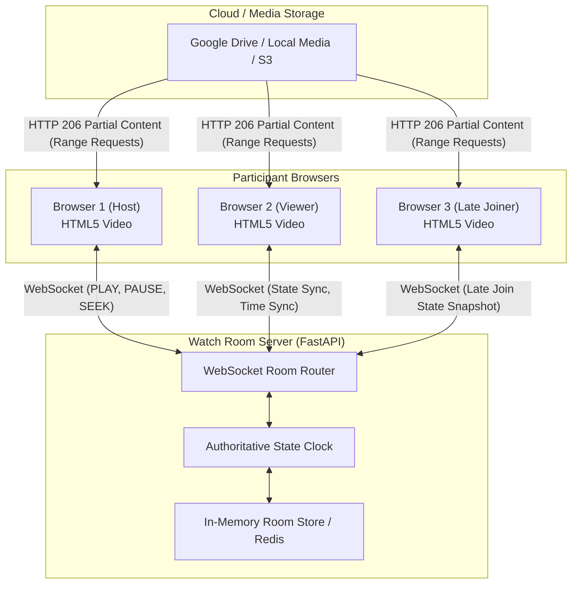

# WatchTogether: Simple Synchronized Watch-Room Web Application

A full-stack, low-latency web application that allows multiple participants to enter a shared private "watch room" and watch movies/videos synchronously.

The system is built on a fundamental architectural principle: **The high-bandwidth video data path and the low-latency playback synchronization path are strictly separated.**

---

## Architecture Overview



### 1. Why Video Delivery and Synchronization Are Separated
In naive watch-party implementations, the server proxies or transcodes the video stream to every connected user:
```
Storage ──> Backend Server ──> User 1, User 2, User 3...
```
This quickly causes server network bottlenecks, severe CPU and memory pressure, expensive bandwidth costs, and buffering delays.

In **WatchTogether**:
* **Video Path**: Each browser requests media directly using standard **HTTP Range Requests** (`Range: bytes=X-Y` $\rightarrow$ `206 Partial Content`). Browsers buffer and seek progressively without passing heavy video bytes through the synchronization server.
* **Control Path**: The backend communicates tiny JSON messages over full-duplex WebSockets (`PLAY`, `PAUSE`, `SEEK`, `TIME_SYNC`), with payloads typically $< 150$ bytes and transmission latency $< 30\text{ms}$.

### 2. Why WebSockets Are Used
WebSockets maintain a persistent, bidirectional, full-duplex TCP channel between the client and server. Playback commands trigger instant event broadcasts without the polling delays, header overhead, or connection handshakes inherent to HTTP request loops.

### 3. Why WebRTC Is Not Used
WebRTC is designed for real-time peer-to-peer audio/video streaming (e.g. video conferencing). For synchronized watching of pre-encoded video files:
* WebRTC requires complex signaling, STUN/TURN servers, NAT traversal, and peer upload bandwidth.
* One user's upload connection would have to feed multiple viewers.
* In contrast, HTTP byte-range delivery from cloud storage paired with WebSocket state coordination is lighter, more scalable, and browser-native.

---

## Synchronization Mechanics

### 1. Authoritative Server State
The server acts as the single source of truth for the room:
```json
{
  "roomId": "AB7X9K",
  "isPlaying": true,
  "position": 124.50,
  "lastStateChangeServerTime": 1789234567890
}
```

When video is playing, the authoritative position at any server time $T$ is computed as:
$$\text{currentPosition} = \text{position} + \frac{T - \text{lastStateChangeServerTime}}{1000}$$

### 2. NTP-Style Server Clock Synchronization
Devices rarely have identical system clocks. Comparing local `Date.now()` between different machines introduces errors. WatchTogether implements a lightweight NTP ping cycle:
1. Client records $T_1 = \text{Date.now()}$ and sends `{ type: "TIME_SYNC", t1: T_1 }`.
2. Server timestamps $T_3$ and replies with `{ type: "TIME_SYNC_REPLY", t1: T_1, serverTime: T_3 }`.
3. Client receives reply at $T_4 = \text{Date.now()}$.
4. Round Trip Time: $\text{RTT} = T_4 - T_1$.
5. Server Clock Offset: $\Delta = T_3 - \frac{T_1 + T_4}{2}$.
6. Estimated Server Time: $\text{nowServer}() = \text{Date.now}() + \Delta$.

### 3. Multi-Tier Drift Correction
The client-side `PlaybackSynchronizer` continuously evaluates drift:
$$\text{drift} = \text{authoritativePosition} - \text{videoElement.currentTime}$$

* **Band 1: $|\text{drift}| < 150\text{ms}$ (Deadband)**: Imperceptible. No action taken. `playbackRate` remains `1.0x`.
* **Band 2: $150\text{ms} \le |\text{drift}| \le 1.5\text{s}$ (Tempo Adjustment)**:
  * If lagging behind ($\text{drift} > 0$): sets `playbackRate = 1.05x` to smoothly catch up without audio pitch distortion.
  * If ahead ($\text{drift} < 0$): sets `playbackRate = 0.95x` to let the room catch up.
  * Returns to `1.0x` once within the deadband.
* **Band 3: $|\text{drift}| > 1.5\text{s}$ (Hard Seek)**: Immediately sets `video.currentTime = authoritativePosition` and restores `playbackRate = 1.0x`.

### 4. Feedback Loop Prevention
DOM `play`, `pause`, and `seeked` events are tagged with an internal state:
$$\text{PlaybackChangeSource} \in \{\text{USER}, \text{REMOTE}, \text{SYNC}\}$$
WebSocket messages are only dispatched when the action originates from explicit user interaction (`USER`). Programmatic adjustments initiated by remote events or sync loops do not broadcast echoed messages back to the server.

### 5. Late Joiner Synchronization
When a participant enters a room that has already been playing for 30 minutes:
1. The WebSocket connection completes.
2. The server delivers the authoritative `ROOM_STATE` snapshot.
3. The late joiner computes the exact current timestamp $\text{targetPosition}$ and seeks directly there.
4. The client UI displays `Synchronizing...` while initial media chunks are buffered, then resumes playback automatically.

---

## Host Controls and Permissions

* **Host Only Mode (Default)**: Only the room creator (or designated host) can play, pause, seek, or change video. Unauthorized requests from participants are rejected server-side with HTTP / WebSocket `403` errors.
* **Everyone Mode**: Any connected participant can control playback. Commands are processed sequentially in server arrival order.
* **Host Departure & Transfer**: If the host disconnects, host authority is automatically transferred to the next connected participant (`HOST_CHANGED` broadcast).

---

## Google Drive Integration

### OAuth 2.0 Security
* Users connect Google Drive via standard OAuth 2.0 Authorization Code flow with the `drive.readonly` scope.
* **Tokens are never exposed**: Google OAuth `access_token` and `refresh_token` are stored securely in backend session storage and are **never** transmitted to the browser or other room participants.

### Media Serving Strategy
1. **Direct HTTP Range Streaming**: For local media and imported video files.
2. **Drive Import to Cache**: Because Google Drive private files do not natively support unauthenticated browser `<video>` range requests and apply daily rate limits per file, the host can import a Drive video into high-speed application storage (`backend/sample_media/`) with one click, providing seamless range requests to all participants.
3. **Demo / Sample Media**: Includes bundled test videos (`Big Buck Bunny`, `MDN Flower`) for immediate local testing without needing Google Cloud credentials.

---

## Getting Started (Local Development)

### Prerequisites
* Python 3.10+ (tested on Python 3.11 & 3.14)
* Node.js 18+ & npm

### 1. Backend Setup
```bash
cd backend

# Install dependencies
py -m pip install -r requirements.txt

# Run automated tests
py -m pytest -v

# Start FastAPI server
py -m uvicorn app.main:app --host 0.0.0.0 --port 8000 --reload
```
The backend API will be available at `http://localhost:8000`.
Health check: `http://localhost:8000/api/health`.

### 2. Frontend Setup
```bash
cd frontend

# Install dependencies
npm install

# Start Vite dev server
npm run dev
```
The frontend will be available at `http://localhost:5173`.

---

## Google OAuth Configuration (Optional)

To enable picking videos from your Google Drive:
1. Go to the [Google Cloud Console](https://console.cloud.google.com/).
2. Create a project and enable the **Google Drive API**.
3. Go to **APIs & Services > Credentials** and click **Create Credentials > OAuth client ID**.
4. Set Application Type to **Web application**.
5. Add Authorized redirect URIs:
   ```
   http://localhost:8000/api/auth/google/callback
   ```
6. Copy the Client ID and Client Secret into your `.env` file:
   ```env
   GOOGLE_CLIENT_ID=your-client-id.apps.googleusercontent.com
   GOOGLE_CLIENT_SECRET=your-client-secret
   GOOGLE_REDIRECT_URI=http://localhost:8000/api/auth/google/callback
   ```
7. Restart the backend server.

---

## Testing Playback Synchronization

1. Open `http://localhost:5173` in Browser Window 1 (Host).
2. Click **Create Watch Room** and select the default sample video (`Big Buck Bunny`).
3. Click **Launch Watch Room**.
4. Click **Copy Room Invite Link** (e.g. `http://localhost:5173/room/AB7X9K`).
5. Open the link in Browser Window 2 (Incognito or second browser).
6. Verify:
   * Both browsers load the movie.
   * Host presses **Play** $\rightarrow$ both windows play immediately ($< 100\text{ms}$).
   * Host pauses $\rightarrow$ both windows pause.
   * Host seeks along the timeline $\rightarrow$ both windows seek to the same timestamp.
7. Click the **Diagnostics** button on the top right to open the **Debug Panel**:
   * View live authoritative position, local position, drift in milliseconds, and WebSocket RTT.
   * Click **+2s Drift** or **-2s Drift** to inject artificial offset and observe how the synchronizer automatically ramps `playbackRate` (1.05x or 0.95x) to correct playback smoothly.

---

## Security Considerations

1. **Host Privileges**: Evaluated on the server. A malicious participant cannot send `{ "isHost": true }` or control playback when `HOST_ONLY` mode is active.
2. **Session Token Isolation**: Google Drive access tokens are isolated in memory and never exposed via API responses or WebSocket broadcasts.
3. **Input Sanitization**: Room IDs and participant display names are sanitized to prevent XSS or injection attacks.
4. **DRM & Access Control**: The application streams media provided or authorized by the host and does not circumvent DRM or third-party access controls.

---

## Production Deployment & Scalability

* **Containerization**: `docker-compose up --build` boots both the backend and frontend in isolated containers.
* **Horizontal Scaling**: The `RoomRepository` is abstracted behind an interface and can be backed by **Redis** and **Redis Pub/Sub** for multi-node deployments.
* **CDN Integration**: In production, application storage points to Amazon S3, Cloudflare R2, or Google Cloud Storage fronted by a CDN (Cloudflare or AWS CloudFront), ensuring video bytes are served with maximum bandwidth directly to viewers around the globe.
